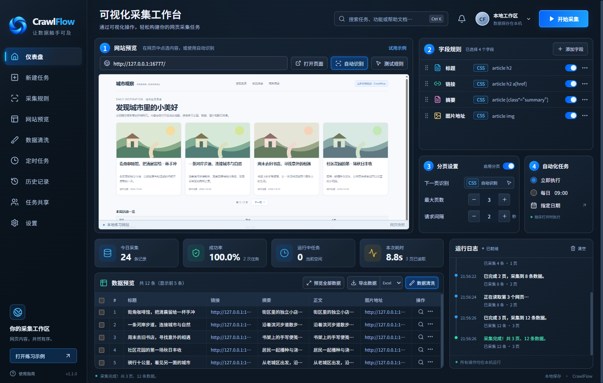

# CrawlFlow

面向零代码用户的 Windows 可视化网页采集工具。

粘贴网址、识别字段、测试一页，然后采集并导出。公开网页和登录后可见的网页都可以使用。



## 下载 1.1

从 [CrawlFlow 1.1 发布页](https://github.com/chenforge/CrawlFlow/releases/tag/v1.1.0) 获取：

- `CrawlFlow-1.1.0-Setup-x64.exe`：Windows x64 安装版，可选择安装目录，创建桌面与开始菜单快捷方式。
- `CrawlFlow-1.1.0-Portable-x64.zip`：免安装版，解压后双击 `CrawlFlow.exe`。
- `CrawlFlow-1.1.0-Source.zip`：本版本完整源码。
- `SHA256SUMS.txt`：下载文件校验值。

程序无需另行安装 Node.js、Python 或浏览器。目前未配置商业代码签名。

## 功能

- 真实网页快照、字段规则、分页设置、数据预览与运行日志集中在工作台。
- 文章、链接、图片地址和 HTML 表格四种模板，支持网页点选与自定义 CSS 字段。
- 多个起始网址、自动或手动点选翻页、访问间隔、关键词筛选、结果上限和去重。
- 在独立网页窗口完成登录，采集时沿用本机登录状态。
- 查看、搜索和选择采集结果，导出 Excel、CSV 或 JSON。
- 数据清洗支持首尾空格、空行、重复行及文字替换，可撤销上次应用。
- 每日和单次定时任务，历史结果查看与设置复用。
- 通过 `.crawlflow.json` 任务包分享采集设置。

## 开始使用

首次启动会显示随程序附带的本地练习网站，点击“开始采集”即可体验 3 页、12 条文章的采集。

1. 在“新建任务”粘贴网址，选择采集模板。
2. 在工作台点击“自动识别”，查看真实网页和字段。
3. 点击“测试规则”核对一页结果，再开始采集。
4. 查看或清洗结果，导出需要的格式。

需要登录时，点击“打开网页 / 登录”，在网页窗口自行完成登录后返回。添加自定义字段时，为字段命名并去网页点选；多个字段请选择同一条记录中的内容。

## 数据与范围

定时任务按本机时间执行，需保持程序打开。关闭期间错过的单次任务不会补跑；其他任务正在运行时，定时任务等待空闲。

最近 20 个正式采集任务自动保存在本机。预览不写入历史，停止或失败后的已采集内容仍可导出。数据清洗仅修改当前结果，不改动历史原始数据。

升级继续使用 `%APPDATA%\轻采集`，保留原版历史与网页登录状态。任务包不包含采集结果或浏览器登录状态。

单任务最多 50 页、10,000 条结果，访问间隔至少 1 秒。文章模板读取当前网页，不自动进入每篇文章详情；需要完整正文时，可批量添加详情页网址。图片模板导出图片地址。复杂表格、无限滚动或特殊网页可能需要单独设置规则，建议先测试一页。

## 开发

Windows x64，Node.js 22.12 或更高版本。

```powershell
npm ci
npm start
```

```powershell
npm test
npm run build
npm run package
npm run package:installer
```

产物位于 `release/`。界面在 `src/`，采集引擎在 `electron/`。使用 React、Vite 与 Electron。网页在隔离的浏览器会话中执行，不开放 Node.js 权限。

## 验证

1.1 版通过输入与导出、定时计算、真实网页预览和定时执行、界面功能等检查。免安装 EXE 实际启动后完成了 3 页、12 条采集；安装版验证了自定义 D 盘目录安装、启动和真实预览。

中文字体 Noto Sans SC 的 SIL Open Font License 保存在 `public/fonts/OFL.txt`。
