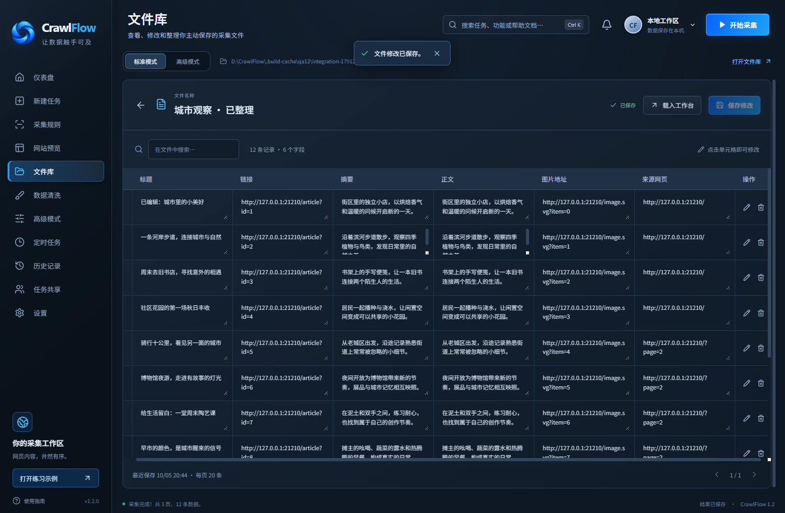

# CrawlFlow

面向零代码用户的 Windows 网页采集工具。粘贴网址、点选字段、预览结果，确认后再保存。


## 下载 1.2

在 [1.2 发布页](https://github.com/chenforge/CrawlFlow/releases/tag/v1.2.0) 下载：

- `CrawlFlow-1.2.0-Setup-x64.exe`：安装版，默认安装到 `D:\CrawlFlow\App`，可修改目录。
- `CrawlFlow-1.2.0-Portable-x64.zip`：免安装版，解压到非 C 盘后运行 `CrawlFlow.exe`。
- `CrawlFlow-1.2.0-Source.zip`：源码；`SHA256SUMS.txt`：下载校验值。

适用于 Windows x64，无需安装 Node.js、Python 或浏览器。当前未配置商业代码签名。

## 1.2 的变化

- **文件结构**：采集网络、文件存储、迁移与界面功能分开维护，清除旧品牌素材及开发产物。
- **交互动效**：侧栏和模式开关的选中背景随操作滑动，页面、弹窗和按钮加入过渡；支持系统“减少动画”偏好。
- **高级模式**：可选择 HTTP / HTTPS、网页编码、浏览器标识、自定义请求头、超时、重试次数，以及是否加载图片和音视频。
- **文件库**：采集结果先留在预览中，手动保存后才写入文件库。可搜索、改名、编辑单元格、删除记录和删除文件。



## 开始使用

首次启动显示本地练习网站。直接点击“开始采集”，可体验 3 页、12 条文章的采集。

1. 在“新建任务”粘贴网址，选择文章、链接、图片或表格模板。
2. 返回仪表盘，点击“自动识别”；需要调整时，在“采集规则”中点选网页字段。
3. “测试规则”核对一页，再开始采集。
4. 预览、搜索或清洗结果，确认后点击“保存到文件库”，也可导出 Excel、CSV、JSON。
5. 从“文件库”重新打开数据，编辑后点击“保存修改”。

需要登录时，点击“打开网页 / 登录”，在网页窗口完成登录，再返回采集。同一电脑上的登录状态会保留。多个自定义字段请选择同一条记录里的内容。

## 数据放在哪里

程序统一使用 CrawlFlow 目录下的 `Data` 文件夹，不把采集结果写到 C 盘。

```text
CrawlFlow/
  CrawlFlow.exe          免安装版启动程序
  App/                   安装版程序（默认目录）
  Data/
    Collections/         文件库，保存后可继续编辑
    Exports/             Excel、CSV、JSON 和任务包导出
    History/             最近任务的状态和设置
    Runtime/             界面设置、网页登录与运行缓存
    Trash/               删除文件的恢复副本
```

免安装版的 `Data` 随 EXE 所在目录；默认安装版使用 `D:\CrawlFlow\Data`。安装在其他非 C 盘目录时使用该目录下的 `Data`；如果程序位于 C 盘，数据会使用 `D:\CrawlFlow\Data`。电脑没有可用 D 盘时，请把程序放到其他可写的非 C 盘目录。

采集结果不会自动保存。退出、开始另一轮采集或替换结果时，会提醒处理未保存内容。最近 20 个任务的历史仅保留状态和设置；重启后，只有已保存到文件库的结果能再次查看。文件库编辑与清洗不会自动覆盖已有文件。导出是独立副本，之后在文件库里修改数据不会同步修改已导出的文件。

文件库删除操作把文件移入 `Data/Trash`。需要恢复时，关闭程序，把对应 JSON 文件移回 `Data/Collections` 后重新打开。卸载新版会保留 `Data`。

首次升级自动迁移旧版 `%APPDATA%\轻采集` 中的有效历史、计划和网页登录资料；应用本身不自动删除旧目录。复制整个 `Data` 可在本机备份，网页登录凭据可能受到 Windows 账户加密限制，不能保证换电脑后仍可使用。

## 高级模式与采集范围

多数网页使用标准模式即可。乱码时可尝试 UTF-8、GB18030 / GBK、Big5 或 Shift_JIS。协议选项用于起始请求，网站仍可自行重定向。自定义请求头仅发往目标同源页面，不发送给外部资源；Cookie、Authorization 等登录信息请通过登录窗口设置。

定时任务按本机时间执行，需要保持程序打开。关闭期间错过的单次任务不补跑；已有任务运行或有未保存内容时等待处理完毕。计划采集的结果同样需要预览后手动保存。

单任务最多 50 页、10,000 条结果，访问间隔至少 1 秒。文章模板读取当前页面，不自动进入文章详情；完整正文可批量添加详情页网址。图片模板保存图片地址。复杂表格、无限滚动或特殊页面可能需要单独调整规则，建议先测试一页。

## 开发

使用 Windows x64 和 Node.js 22.12 或更高版本：

```powershell
npm ci
npm start
npm test
npm run package:release
```

产物在 `release/`。`src/features/` 放高级模式与文件库，`src/shared/` 放通用交互组件；`electron/` 放采集、网络、存储和迁移模块。开发数据位于项目旁的 `Data`（本发行目录为 `CrawlFlow/Source` 时使用其父目录）。开发目录同样需位于非 C 盘。网页不开放 Node.js 权限。

1.2 通过 26 项单元测试，以及真实 Electron 窗口内的采集、保存、编辑、重启、删除、网络参数、定时等待和退出保护检查。中文字体授权见 `public/fonts/OFL.txt`。
